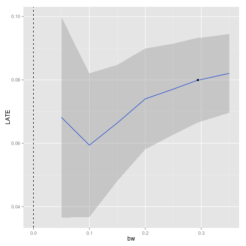

RDDtools: an R package for Regression Discontinuity Design
========================================================

**RDDtools** is a new R package under development, designed to offer a set of tools to run all the steps required for a Regression Discontinuity Design (RDD) Analysis, from primary data visualisation to discontinuity estimation, sensitivity and placebo testing. 


Installing **RDDtools**
-----------------------

This github website hosts the source code. One of the easiest ways to install the package from github is by using the R package **devtools**:


```r
library(devtools)
install_github(repo = "RDDtools", username = "MatthieuStigler", subdir = "RDDtools")
```


Note however the latest version of RDDtools only works with R 3.0, and that you might need to install  [Rtools](http://stat.ethz.ch/CRAN/bin/windows/Rtools/) if on Windows. 


Documentation
-----------------------
The (preliminary documentation) is available in the help files directly, as well as in the *vignette*. The vignette can be accessed from R with vignette("RDDtools"), or by accessing the [pdf](https://github.com/MatthieuStigler/RDDtools/raw/master/RDDtools/inst/doc/RDDtools.pdf) stored on this github. 

RDDtools: main features
-----------------------


+  Simple visualisation of the data using binned-plot: **plot()**
+ Estimation:
  +  RDD parametric estimation: **RDDreg_lm()** This includes specifying the polynomial order, including covariates with various specifications as advocated in [Imbens and Lemieux 2008].
  +  RDD local non-parametric estimation: **RDDreg_np()**. Can also include covariates, and allows different types of inference (fully non-parametric, or parametric approximation). 
  +  RDD generalised estimation: allows to use custom estimating functions to get the RDD coefficient. Could allow for example a probit RDD, or quantile regression.
  + Various tools, to obtain predictions at given covariate values (**RDDpred()**), or to convert to other classes, to lm (**as.lm()**), or to the package *np* (**as.npreg()**). 
+ Post-Estimation inference:
  + Function to do inference with clustered data: **clusterInf()** either using a cluster covariance matrix (**vcovCluster()**) or by a degrees of freedom correction (as in [Cameron et al. 2008]).
+ Regression sensitivity analysis:
  + Plot the sensitivity of the coefficient with respect to the bandwith: **plotSensi()**
  + *Placebo plot* using different cutpoints: **plotPlacebo()**
+ Design sensitivity analysis:
  + McCrary test of manipulation of the forcing variable: wrapper **dens_test()** to the function **DCdensity()** from package **rdd**. 
  + Test of equal means of covariates: **covarTest_mean()**
  + Test of equal density of covariates: **covarTest_dens()**


Using RDDtools: a quick example
-----------------------
**RDDtools** works in an object-oriented way: the user has to define once the characteristic of the data, creating a *RDDdata* object, on which different anaylsis tools can be applied. 

Load the package, and load the built-in dataset from [Lee 2008]:


```r
library(RDDtools)
data(Lee2008)
```


Declare the data as a RDDdata object:


```r
Lee2008_rdd <- RDDdata(y = Lee2008$y, x = Lee2008$x, cutpoint = 0)
```


You can now directly summarise and visualise this data:


```r
summary(Lee2008_rdd)
```

```
## ### RDDdata object ###
## 
## Cutpoint: 0 
## Sample size: 
## 	-Full : 6558 
## 	-Left : 2740 
## 	-Right: 3818
## Covariates: no
```

```r
plot(Lee2008_rdd)
```

 


As well as run a simple local regression, using the [Imbens and Kalyanaraman 2012] bandwidth:

```r
bw_ik <- RDDbw_IK(Lee2008_rdd)
reg_nonpara <- RDDreg_np(RDDobject = Lee2008_rdd, bw = bw_ik)
print(reg_nonpara)
```

```
## ### RDD regression: nonparametric local linear###
## 	Bandwidth:  0.2939 
## 	Number of obs: 3200 (left: 1594, right: 1606)
## 
## 	Coefficient:
##   Estimate Std. Error z value Pr(>|z|)    
## D  0.07992    0.00946    8.44   <2e-16 ***
## ---
## Signif. codes:  0 '***' 0.001 '**' 0.01 '*' 0.05 '.' 0.1 ' ' 1
```

```r
plot(x = reg_nonpara)
```

 


One can easily check the sensitivity of the estimate to different bandwidths:

```r
plotSensi(reg_nonpara, from = 0.05)
```

 


  [Imbens and Kalyanaraman 2012]: http://ideas.repec.org/a/oup/restud/v79y2012i3p933-959.html "Imbens, G. & Kalyanaraman, K. (2012) Optimal Bandwidth Choice for the Regression Discontinuity Estimator, Review of Economic Studies, 79, 933-959"
  
  [Lee 2008]: http://ideas.repec.org/a/eee/econom/v142y2008i2p675-697.html "Lee, D. S. (2008) Randomized experiments from non-random selection in U.S. House elections, Journal of Econometrics, 142, 675-697"
  
  [Imbens and Lemieux 2008]: http://ideas.repec.org/a/eee/econom/v142y2008i2p615-635.html "Imbens, G. & Lemieux, T. (2008) Regression discontinuity designs: A guide to practice, Journal of Econometrics, Vol. 142(2), pages 615-635"
  
  [Cameron et al. 2008]: http://ideas.repec.org/a/tpr/restat/v90y2008i3p414-427.html "Cameron, Gelbach and Miller (2008) Bootstrap-Based Improvements for Inference with Clustered Errors, The Review of Economics and Statistics, Vol. 90(3), pages 414-427"


  
